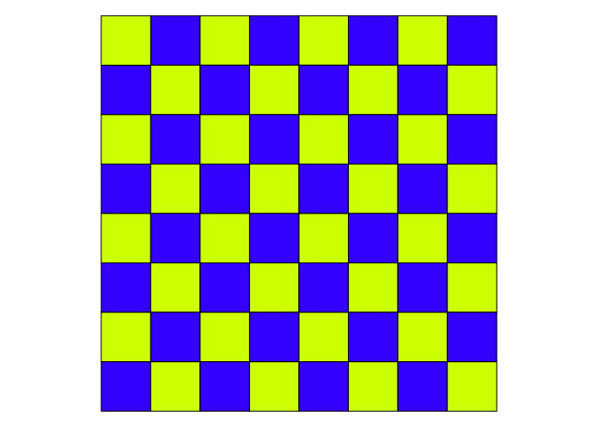
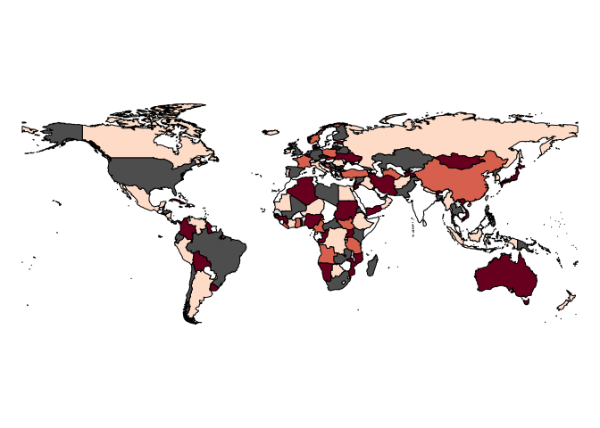

MapColoring
================
Philipp Hunziker
February 2, 2017

The MapColoring package provides functions for assigning colors to polygon maps such that no two adjacent features have the same color, while using a minimal number of colors. If provided more than the minimal required number of colors for a given map, it selects colors in a manner that maximizes color contrasts between adjacent polygons. The package also implements the DSATUR graph coloring algorithm in R.

Installation
------------

You can install the package directly from this repository:

``` r
library(devtools)
install_github("hunzikp/MapColoring")
```

Note that MapColoring depends on the rgeos package, which in turn requires the external GEOS library (&gt;= 3.2.0). To install GEOS on Debian/Ubuntu (&gt;= 12.04), enter

``` bash
sudo apt-get install libgeos-dev
```

Details
-------

As implied by its name, the MapColoring package provides functions for solving the map coloring problem for polygon-based maps in R. Informally, the map coloring problem refers to the task of coloring a collection of polygons in such a way that no two adjacent features share the same color, using as few colors as possible (see [here](https://philipphunziker.wordpress.com/2015/11/10/solving-the-map-coloring-problem-in-r/) for more background information). In addition to providing a solution to the map coloring problem, the package also permits selecting colors in a manner that ensures maximal visual contrast between adjacent features. Specifically, if provided a vector of candidate colors of length *N* and a set of polygon features, the getOptimalContrast() function selects *K* &lt; *N* colors, and assigns them to the polygons, such that

-   no two adjacent features share the same color,
-   *K* is as small as possible, and
-   the mean color contrast between adjacent polygons is as large as possible.

The first two conditions are met by transforming the collection of polygons into an adjacency matrix describing a graph, and then applying the DSATUR algorithm. The discrete optimization problem entailed by the third condition is solved using the CEoptim function in the package of the same name.

Use
---

The MapColoring package's core functionality is contained in the three functions

-   getNColors()
-   getColoring()
-   getOptimalContrast()

To demonstrate these functions, we use the sp package to create a toy map in the shape of a chess board:

``` r
## Make chess board
library(sp)
gt <- GridTopology(c(0,0), c(1,1), c(8,8))
sg <- SpatialGrid(gt)
board <- as(as(sg, "SpatialPixels"), "SpatialPolygons")
```

The getNColors function uses the greedy DSATUR algorithm to calculate the number of colors required to color the provided SpatialPolygons\* object such that no two adjacent features have the same color. Note that if provided a SpatialPolygons\* object, the getNColors function (as well as the getColoring and getOptimalContrast functions) construct an adjacency matrix based on the assumption that only features sharing at least one border segment of positive length are adjacent – thus, features sharing only a corner are ignored. If you'd like to adopt a different adjacency rule, you can directly pass a logical adjacency matrix (instead of a SpatialPolygons\* object) to the MapColoring functions. In the next code segment, we pass the chess board, which is a SpatialPolygons object, to the getNColors function.

``` r
## Get estimate for chromatic number
library(MapColoring)
Ncol <- getNColors(board)
print(Ncol)
```

    ## [1] 2

As we would expect, this returns a value of 2.

The getColoring function employs the greedy DSATUR algorithm to “color” the features of a SpatialPolygons\* object (or an adjacency matrix). The function does not return actual colors, but an integer vector with a color index for each of the features in the provided map. Hence, if we pass the chess board to the getColoring function...

``` r
## Get coloring indices
coloring <- getColoring(board)
print(head(coloring))
```

    ## [1] 1 2 1 2 1 2

...we get an integer vector of length 64 containing the values 1, 2, 1, 2, 1, etc.

Finally, as explained above, the getOptimalContrast function goes a step further, and instead of only assigning color indices, it returns actual colors. Provided a map and a vector of candidate colors, it selects and allocates these colors in a manner such that they match the indexing returned by the getColoring function, and ensures that the average contrast between adjacent polygons is maximized. Color contrasts are measured using their Contrast Ratio, as defined [here](http://www.w3.org/WAI/GL/wiki/Contrast_ratio).

In the following code segment, we pass the chess board together with 20 colors from R's Rainbow palette to the getOptimalContrast function:

``` r
## Get Optimal contrast colors
cand.colors <- rainbow(20)
opt.colors <- getOptimalContrast(x=board, col=cand.colors)

## Plot
par(mar=c(0,0,0,0))
plot(board, col=opt.colors)
```



Interestingly, of those colors passed to the function, the blue-yellow combination appears to have the highest contrast ratio, and indeed, the cells are very clearly distinguishable.

Finally, as a more realistic example, we use the getOptimalContrast function to plot a world map, obtained from the cshapes package. Moreover, instead of relying on the adjacency definition employed above, we define two countries to be adjacent if their borders are within 4 decimal degrees of each other. One reason one might want to do this is to avoid confusion over the status of islands. If the adjacency definition used above is adopted, an island and a proximate region on the mainland may be assigned the same color even though they do not belong to the same country because they do not share a border. Finally, as the set of candidate colors, we use a palette from the RColorBrewer package.

``` r
## Country borders in 2012
library(cshapes)
world.spdf <- cshp(as.Date("2012-06-30"))

## Use loose definition of adjacent
library(rgeos)
adj.mat <- gIntersects(gBuffer(world.spdf, width=2, byid=TRUE), byid=TRUE)

## Get Optimal contrast colors
library(RColorBrewer)
cand.colors <- brewer.pal(11, "RdGy")
opt.colors <- getOptimalContrast(x=adj.mat, col=cand.colors)

## Plot
par(mar=c(0,0,0,0))
plot(world.spdf, col=opt.colors)
```


